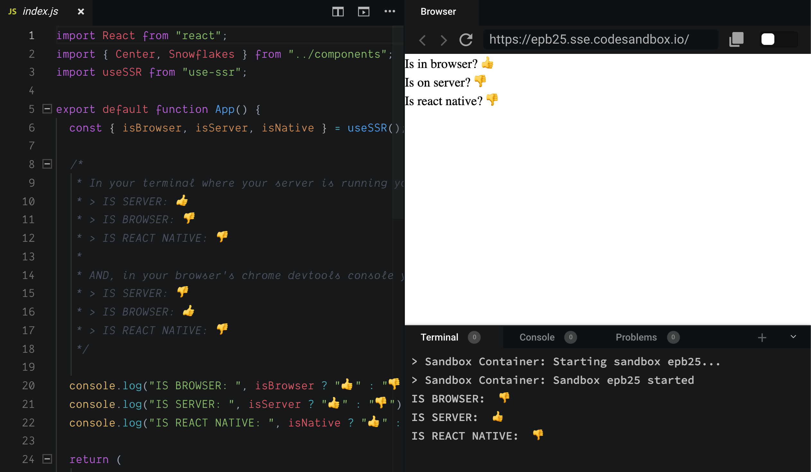

<h1 align="center">useSSR</h1>
<p align="center">☯️ React hook to determine if you are on the server, browser, or react native</p>
<p align="center">
    <a href="https://github.com/alex-cory/use-ssr/pulls">
      
    </a>
    <a href="https://www.npmjs.com/package/use-ssr">
      
    </a>
    <a href="https://lgtm.com/projects/g/alex-cory/use-ssr/context:javascript">
      
    </a>
    <a href="https://bundlephobia.com/result?p=use-ssr">
      
    </a>
    <a href="https://greenkeeper.io/">
      
    </a>
    <a href="https://github.com/alex-cory/use-ssr/blob/master/license.md">
      
    </a>
    <a href="https://codeclimate.com/github/alex-cory/use-ssr/maintainability">
      
    </a>
    <a href="https://snyk.io/test/github/alex-cory/use-ssr?targetFile=package.json">
      
    </a>
    <a href="https://www.npmjs.com/package/use-ssr">
      
    </a>
    <a href="https://circleci.com/gh/alex-cory/use-ssr">
      
    </a>
</p>

Need to know when you're *on the server*, *in the browser* or in *react native* in your components/hooks? This simple hook makes it easy. 🔥

[](https://codesandbox.io/s/usessr-in-nextjs-actual-epb25)

Features
--------
- SSR (server side rendering) support
- TypeScript support
- Zero dependencies
- React Native support

### Examples
- [Example - Next.js - codesandbox container](https://codesandbox.io/s/usessr-in-nextjs-actual-epb25) (sometimes containers are buggy, if so try [this example](https://codesandbox.io/s/usessr-in-nextjs-4gy7v))

Installation
------------

```shell
yarn add use-ssr      or     npm i -S use-ssr
```

Usage
-----

```jsx
import useSSR from 'use-ssr'

const App = () => {
  var { isBrowser, isServer, isNative } = useSSR()
  
  // Want array destructuring? You can do that too!
  var [isBrowser, isServer, isNative] = useSSR()
  
  /*
   * In your browser's chrome devtools console you should see
   * > IS BROWSER: ğŸ‘
   * > IS SERVER: ğŸ‘
   *
   * AND, in your terminal where your server is running you should see
   * > IS BROWSER: ğŸ‘
   * > IS SERVER: ğŸ‘
   */
  console.log('IS BROWSER: ', isBrowser ? '👍' : '👎')
  console.log('IS SERVER: ', isServer ? '👍' : '👎')
  console.log('IS NATIVE: ', isNative ? '👍' : '👎')
  return (
    <>
      Is in browser? {isBrowser ? '👍' : '👎'}
      <br />
      Is on server? {isServer ? '👍' : '👎'}
      <br />
      Is react native? {isNative ? '👍' : '👎'}
    </>
  )
}
```

Options
-------

```js
const {
  isBrowser,
  isServer,
  isNative,
  device, // 'server', 'browser', or 'native'
  canUseWorkers,
  canUseEventListeners,
  canUseViewport,
} = useSSR()
// OR
const [
  isBrowser,
  isServer,
  isNative,
  device, // 'server', 'browser', or 'native'
  canUseWorkers,
  canUseEventListeners,
  canUseViewport,
] = useSSR()
```

Who Uses useSSR?
---------------

<p align="center">
  
</p>

### Todos
- [ ] tests for array destructuring
- [ ] set up code climate test coverage
- [ ] add typescript array return types
- [ ] optimize badges [see awesome badge list](https://github.com/boennemann/badges)
  - [ ] add code climate test coverage badge
- [X] codesandbox examples
- [X] continuous integration
- [X] greenkeeper
